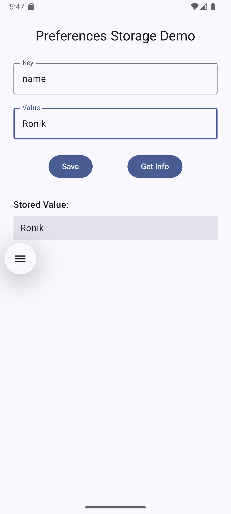
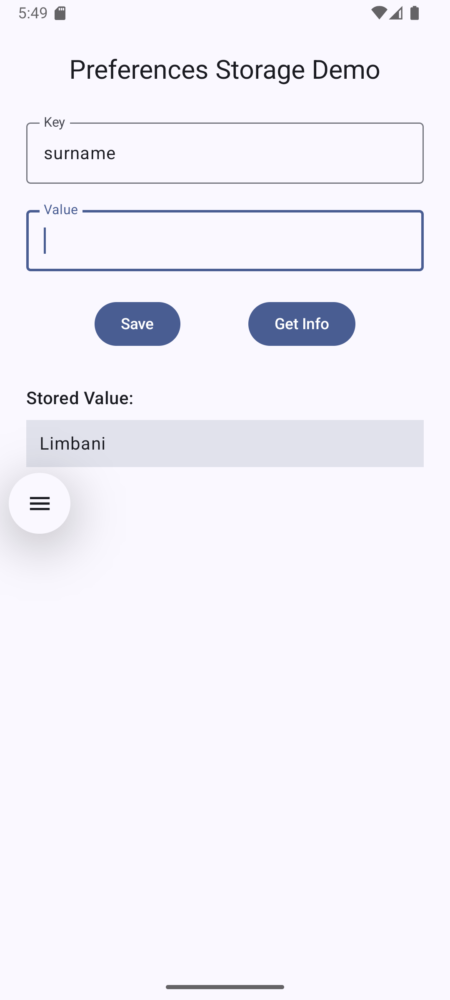

# 📱 Preferences DataStore Demo

This is a simple Jetpack Compose demo project showcasing how to **save and retrieve key-value pairs** using **Jetpack DataStore (Preferences)**. It provides a minimal UI where users can input a key and value, save it to the DataStore, and retrieve it later.

---

## ✨ Features

- Built with **Jetpack Compose**
- Uses **Preferences DataStore** for persistent storage
- Clean and intuitive UI
- Kotlin Coroutines for background operations

---

## 📸 Demo

 <!-- Add a screenshot to your project directory -->

| Save to DataStore | Retrieve from DataStore |
|-------------|-----------------|
|  |  |

---

## 🚀 How It Works

- The user enters a **key** and **value**.
- On clicking **Save**, the data is stored using `DataStore`.
- On clicking **Get Info**, the stored value for the entered key is retrieved and displayed.

---

## 🧩 Tech Stack

- 🧱 Jetpack Compose
- ⚙️ Kotlin Coroutines
- 💾 Jetpack DataStore (Preferences)
- 🎨 Material3 Design Components

---

## 🧑‍💻 Code Overview

### `MainScreen.kt`

```kotlin
@Composable
fun MainScreen(
    preferencesDataStore: PreferencesDataStore
) {
    // UI and state management to store/retrieve data
}
